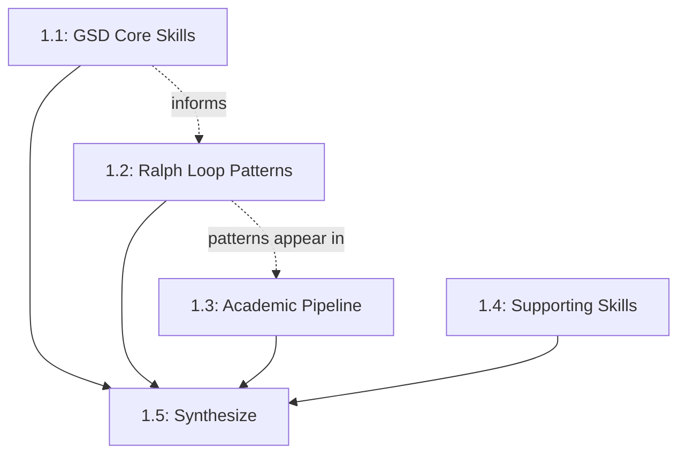

# Phase 1 Plan: Discovery & Research

**Created:** 2026-01-19
**Status:** Ready for Execution

---

## Objective

Comprehensive analysis of all existing components that form the GSD + Ralph Loop ecosystem. Create exhaustive documentation covering architecture, mechanics, integration points, and design rationale.

## Approach Summary

- **Depth:** Comprehensive/exhaustive
- **Output:** Single unified research document (`/research/GSD-RALPH-RESEARCH.md`)
- **Autonomy:** Frequent check-ins at each major skill analysis
- **Focus:** Architecture, Mechanics, Integration Points, Design Rationale

---

## Task Breakdown

### Task 1.1: Analyze GSD Core Skills

**Description:** Deep-dive into the 6 GSD skills that form the project management backbone.

**Skills to Analyze:**
1. `gsd-init` - Project initialization
2. `gsd-orchestrator` - Meta-orchestration and routing
3. `gsd-phase-planner` - Phase planning (discuss + plan modes)
4. `gsd-phase-executor` - Phase execution with Ralph Loop
5. `gsd-phase-verifier` - UAT and verification
6. `gsd-state-manager` - State tracking (decisions, trade-offs, questions)

**Input:**
- Type: file
- Source: `/sessions/kind-friendly-edison/mnt/.skills/skills/gsd-*/`

**Analysis Dimensions:**
- [ ] Architecture: File structure, dependencies, entry points
- [ ] Mechanics: Execution flow, state transitions, error handling
- [ ] Integration: How skills call each other, data handoffs
- [ ] Design Rationale: Why structured this way, trade-offs made

**Completion Promise:** `GSD_CORE_ANALYZED`

**Verification:**
- [ ] All 6 skills documented
- [ ] Inputs/outputs mapped for each
- [ ] Interconnections identified
- [ ] Design patterns extracted

**Check-in:** After completing all 6 GSD skills analysis

---

### Task 1.2: Analyze Ralph Loop Patterns

**Description:** Extract and document the Ralph Loop pattern - the context externalization mechanism that prevents memory exhaustion.

**Skills to Analyze:**
1. `ralph-problem-validation-orchestrator` - Primary Ralph Loop implementation
2. Iteration patterns in `gsd-phase-executor`
3. Handoff mechanisms across all orchestrators

**Input:**
- Type: file
- Source: `/sessions/kind-friendly-edison/mnt/.skills/skills/ralph-*/` and embedded patterns

**Analysis Dimensions:**
- [ ] Core Pattern: What is the Ralph Loop? How does it work?
- [ ] State Externalization: How is context saved to disk?
- [ ] Iteration Tracking: How are iterations counted/bounded?
- [ ] Handoff Protocol: What format? What information preserved?
- [ ] Recovery: How does it resume after context switch?

**Completion Promise:** `RALPH_LOOP_ANALYZED`

**Verification:**
- [ ] Ralph Loop pattern clearly documented
- [ ] File-based state mechanism explained
- [ ] Iteration/handoff formats captured
- [ ] Benefits articulated (why this prevents context exhaustion)

**Check-in:** After Ralph Loop pattern analysis complete

---

### Task 1.3: Analyze Academic Pipeline

**Description:** Document the academic content generation pipeline that we'll use in Phase 4.

**Skills to Analyze:**
1. `academic-pipeline-orchestrator` - Master orchestrator
2. `research-analyst` - Source analysis and structure planning
3. `research-writer` - Iterative content writing
4. `bibliography-generator` - Citation formatting
5. Related: `bibtex-theme-analyzer`, `academic-perspective-builder`

**Input:**
- Type: file
- Source: `/sessions/kind-friendly-edison/mnt/.skills/skills/academic-*/`, `research-*`, `bibliography-*`, `bibtex-*`

**Analysis Dimensions:**
- [ ] Pipeline Flow: What order do skills execute?
- [ ] Handoff Format: What data passes between stages?
- [ ] Quality Controls: How is academic rigor ensured?
- [ ] Integration: How does this connect to GSD/Ralph Loop?

**Completion Promise:** `ACADEMIC_PIPELINE_ANALYZED`

**Verification:**
- [ ] Full pipeline documented
- [ ] Stage dependencies mapped
- [ ] Handoff formats captured
- [ ] Ready to use in Phase 4

**Check-in:** After academic pipeline analysis complete

---

### Task 1.4: Analyze Supporting Skills

**Description:** Document supporting skills that integrate with the core frameworks.

**Skills to Analyze:**
1. `problem-statement-extractor` - Problem definition
2. `problem-awareness-discovery` - Market research
3. `moxywolf` - Brand voice and document styling

**Input:**
- Type: file
- Source: `/sessions/kind-friendly-edison/mnt/.skills/skills/problem-*/`, `moxywolf/`

**Analysis Dimensions:**
- [ ] Purpose: What problem does each solve?
- [ ] Integration: How do they plug into GSD/Ralph?
- [ ] Outputs: What do they produce?

**Completion Promise:** `SUPPORTING_SKILLS_ANALYZED`

**Verification:**
- [ ] All 3 skills documented
- [ ] Integration points identified
- [ ] Role in ecosystem clear

**Check-in:** After supporting skills analysis complete

---

### Task 1.5: Synthesize Research Document

**Description:** Compile all analyses into single comprehensive research document.

**Input:**
- Type: previous_handoff
- Source: Outputs from Tasks 1.1-1.4

**Output:** `/research/GSD-RALPH-RESEARCH.md`

**Sections:**
1. Executive Summary
2. GSD Framework Analysis
3. Ralph Loop Pattern Analysis
4. Academic Pipeline Analysis
5. Supporting Skills Analysis
6. Integration Map (how everything connects)
7. Design Philosophy (extracted patterns and rationale)
8. Gaps and Opportunities (feed into Phase 3)

**Completion Promise:** `RESEARCH_SYNTHESIS_COMPLETE`

**Verification:**
- [ ] All sections complete
- [ ] Cross-references accurate
- [ ] Gaps clearly identified
- [ ] Ready to feed Phase 2

**Check-in:** Final review before Phase 1 sign-off

---

## Dependency Graph

**Note:** Tasks 1.1-1.4 can run sequentially with check-ins. Task 1.5 requires all prior tasks complete.

---

## UAT Criteria

### Deliverables
- [ ] `/research/GSD-RALPH-RESEARCH.md` exists and is complete
- [ ] All 6 GSD skills documented
- [ ] Ralph Loop pattern documented
- [ ] Academic pipeline documented
- [ ] Supporting skills documented

### Quality
- [ ] Analysis depth is comprehensive (not surface-level)
- [ ] Architecture, mechanics, integration, rationale covered for each
- [ ] Cross-references between components are accurate
- [ ] No placeholder text remains

### Objective
- [ ] Clear understanding of how GSD + Ralph Loop work together
- [ ] Gaps identified for Phase 3
- [ ] Foundation ready for Phase 2 theoretical framework

---

## Estimates

| Task | Description | Est. Time |
|------|-------------|-----------|
| 1.1 | GSD Core Skills (6 skills) | 90-120 min |
| 1.2 | Ralph Loop Patterns | 45-60 min |
| 1.3 | Academic Pipeline | 45-60 min |
| 1.4 | Supporting Skills | 30-45 min |
| 1.5 | Synthesis | 45-60 min |
| **Total** | | **4-6 hours** |

---

## Notes

- Check in after each major task (1.1, 1.2, 1.3, 1.4) before proceeding
- Single document output means building incrementally
- MoxyWolf voice not required for research notes (clarity over style)
- Gaps identified here directly feed Phase 3 planning
