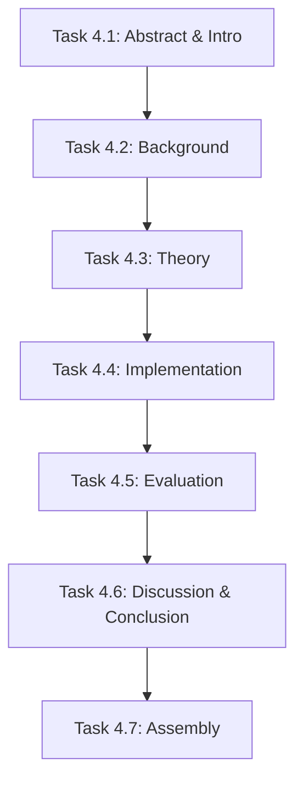

# Phase 4 Plan: Academic Paper Draft

**Phase:** 4 of 6
**Objective:** Write the full academic paper using the GSD + Ralph Loop methodology (self-demonstrating proof)
**Target Length:** 8,000-10,000 words

---

## Task Breakdown

### Task 4.1: Abstract & Introduction (~1,100 words)

**Objective:** Write Abstract (225 words) and Section 1 Introduction (900 words)

**Inputs:**
- `/research/PAPER-OUTLINE.md` - Detailed section outline
- `/research/ACADEMIC-POSITIONING.md` - Novel contribution positioning
- `/research/THEORETICAL-FRAMEWORK.md` - Problem formalization

**Outputs:**
- Paper draft with Abstract and Section 1 complete

**Completion Promise:** `ABSTRACT_INTRO_COMPLETE`

---

### Task 4.2: Background & Related Work (~1,350 words)

**Objective:** Write Section 2 covering context limitations, existing approaches, and gap identification

**Inputs:**
- `/research/LITERATURE-REVIEW.md` - All academic sources
- `/research/bibliography.bib` - Citation keys
- `/research/PAPER-OUTLINE.md` - Section 2 outline

**Outputs:**
- Section 2 added to paper draft with proper citations

**Completion Promise:** `BACKGROUND_COMPLETE`

---

### Task 4.3: Theoretical Framework (~1,650 words)

**Objective:** Write Section 3 with problem formalization, bounded context solution, and seven principles

**Inputs:**
- `/research/THEORETICAL-FRAMEWORK.md` - Full theoretical content
- `/research/PAPER-OUTLINE.md` - Section 3 outline

**Outputs:**
- Section 3 added to paper draft

**Completion Promise:** `THEORY_COMPLETE`

---

### Task 4.4: Implementation (~1,650 words)

**Objective:** Write Section 4 covering system architecture, GSD framework, and Ralph Loop pattern

**Inputs:**
- `/research/GSD-RALPH-RESEARCH.md` - Component analysis
- `/research/SKILL-REGISTRY.md` - Skill documentation
- `/research/SKILL-DEPENDENCIES.md` - Architecture diagrams
- `/templates/handoff-schemas/*.json` - Schema examples

**Outputs:**
- Section 4 added to paper draft

**Completion Promise:** `IMPLEMENTATION_COMPLETE`

---

### Task 4.5: Evaluation (~1,350 words)

**Objective:** Write Section 5 with case study (this paper), token analysis, and qualitative assessment

**Inputs:**
- This project's execution metrics
- `/ORCHESTRATION.md` - Phase completion tracking
- Token usage estimates from research

**Outputs:**
- Section 5 added to paper draft

**Completion Promise:** `EVALUATION_COMPLETE`

---

### Task 4.6: Discussion & Conclusion (~1,250 words)

**Objective:** Write Section 6 (discussion) and Section 7 (conclusion)

**Inputs:**
- `/research/ACADEMIC-POSITIONING.md` - Limitations section
- `/research/GAP-ANALYSIS-SUMMARY.md` - Future work items
- `/research/PAPER-OUTLINE.md` - Sections 6-7 outline

**Outputs:**
- Sections 6-7 added to paper draft

**Completion Promise:** `DISCUSSION_CONCLUSION_COMPLETE`

---

### Task 4.7: References & Assembly

**Objective:** Compile full references, finalize formatting, create complete paper file

**Inputs:**
- `/research/bibliography.bib` - All citations
- Complete paper sections from Tasks 4.1-4.6

**Outputs:**
- `/paper/BOUNDED-CONTEXT-ORCHESTRATION.md` - Complete paper draft
- Updated bibliography with all used citations

**Completion Promise:** `PAPER_ASSEMBLED`

---

## Skill Mapping

| Task | Primary Skill | Supporting Skills |
|------|--------------|-------------------|
| 4.1 | research-writer | moxywolf, academia-formatting |
| 4.2 | research-writer | bibliography-generator |
| 4.3 | research-writer | moxywolf |
| 4.4 | research-writer | moxywolf |
| 4.5 | research-writer | moxywolf |
| 4.6 | research-writer | moxywolf |
| 4.7 | bibliography-generator | academia-formatting |

---

## Token Budget Estimates

| Task | Input Tokens | Output Tokens | Total |
|------|--------------|---------------|-------|
| 4.1 | ~2000 | ~1500 | ~3500 |
| 4.2 | ~2500 | ~1800 | ~4300 |
| 4.3 | ~2500 | ~2200 | ~4700 |
| 4.4 | ~3000 | ~2200 | ~5200 |
| 4.5 | ~2000 | ~1800 | ~3800 |
| 4.6 | ~2000 | ~1600 | ~3600 |
| 4.7 | ~3000 | ~1000 | ~4000 |

---

## Dependencies

---

## Output Location

`/paper/BOUNDED-CONTEXT-ORCHESTRATION.md`

---

## Phase Completion Promise

`PHASE_4_PAPER_COMPLETE`
