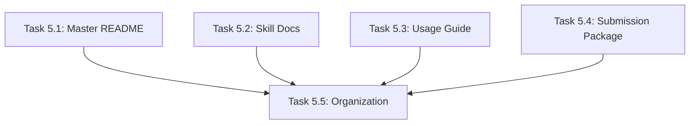

# Phase 5 Plan: Documentation & Packaging

**Phase:** 5 of 6
**Objective:** Create all supporting documentation and package for distribution

---

## Task Breakdown

### Task 5.1: Master README

**Objective:** Create comprehensive README.md for the GSD + Ralph Loop framework

**Content:**
- What it is (one paragraph)
- Why it matters (the problem it solves)
- Quick start (5-minute setup)
- Architecture overview
- Component list with links
- Usage examples
- Contributing guidelines

**Output:** `/README.md`

**Completion Promise:** `README_COMPLETE`

---

### Task 5.2: Individual Skill Documentation

**Objective:** Create concise README for each GSD skill

**Skills to document:**
- gsd-init
- gsd-orchestrator
- gsd-phase-planner
- gsd-phase-executor
- gsd-phase-verifier
- gsd-state-manager

**Format per skill:**
- Purpose (2 sentences)
- Triggers (when to use)
- Inputs/Outputs
- Example usage
- Common patterns

**Output:** `/docs/skills/` directory with 6 READMEs

**Completion Promise:** `SKILL_DOCS_COMPLETE`

---

### Task 5.3: Usage Guide with Examples

**Objective:** Create practical guide showing BCO in action

**Content:**
- Starting a new project walkthrough
- Planning a phase walkthrough
- Executing with Ralph Loop walkthrough
- Verifying and completing walkthrough
- Common patterns (research→synthesis→output)
- Troubleshooting FAQ

**Output:** `/docs/USAGE-GUIDE.md`

**Completion Promise:** `USAGE_GUIDE_COMPLETE`

---

### Task 5.4: ResearchGate Submission Package

**Objective:** Prepare complete submission package

**Contents:**
- Paper (PDF version)
- Supplementary materials ZIP
- Abstract for submission form
- Keywords list
- Author bio

**Output:** `/submission/` directory

**Completion Promise:** `SUBMISSION_PACKAGE_COMPLETE`

---

### Task 5.5: File Organization & Cleanup

**Objective:** Organize all project files for distribution

**Actions:**
- Ensure consistent naming
- Remove temporary/draft files
- Create final directory structure
- Verify all links work
- Create manifest/index

**Output:** Clean, organized project structure

**Completion Promise:** `FILES_ORGANIZED`

---

## Skill Mapping

| Task | Primary Skill | Supporting Skills |
|------|--------------|-------------------|
| 5.1 | moxywolf | - |
| 5.2 | moxywolf | - |
| 5.3 | moxywolf | - |
| 5.4 | pdf | moxywolf |
| 5.5 | - | bash |

---

## Dependencies

Tasks 5.1-5.4 can run in parallel. Task 5.5 depends on all others.

---

## Phase Completion Promise

`PHASE_5_DOCS_COMPLETE`
