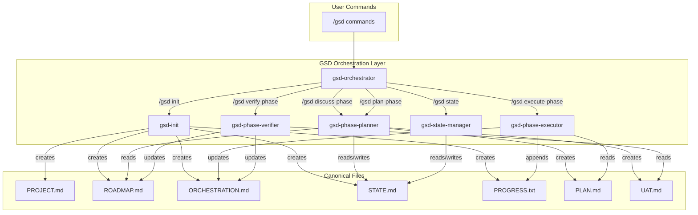
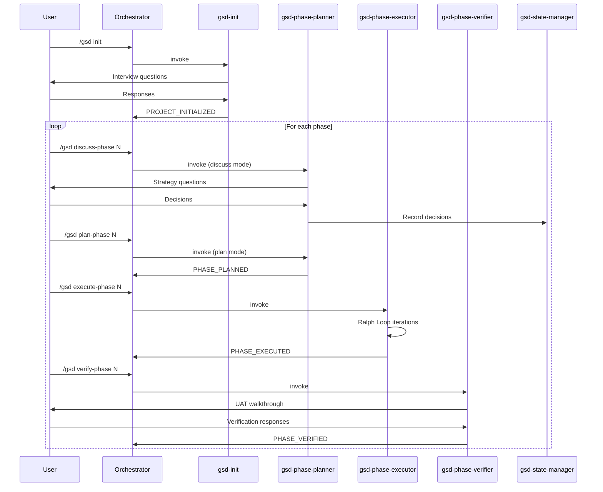
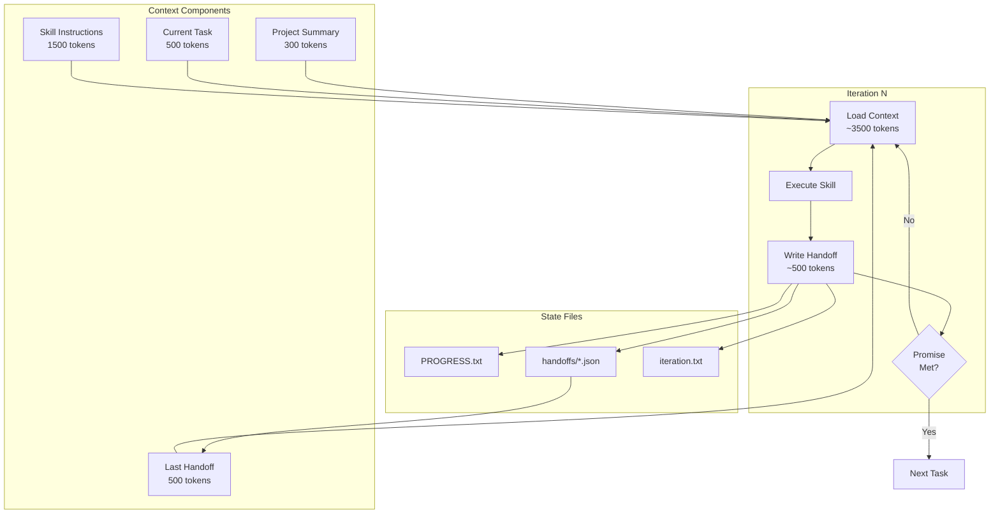
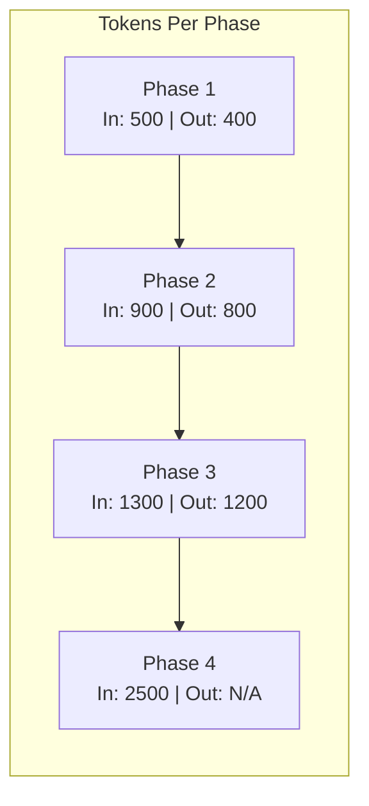
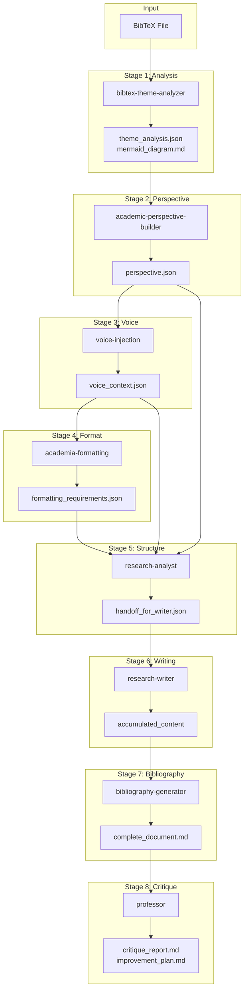
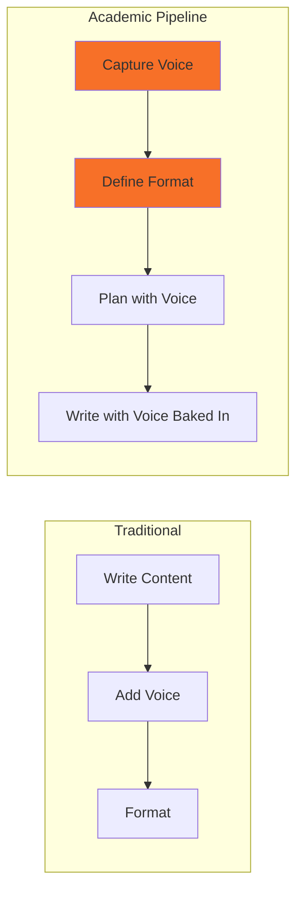
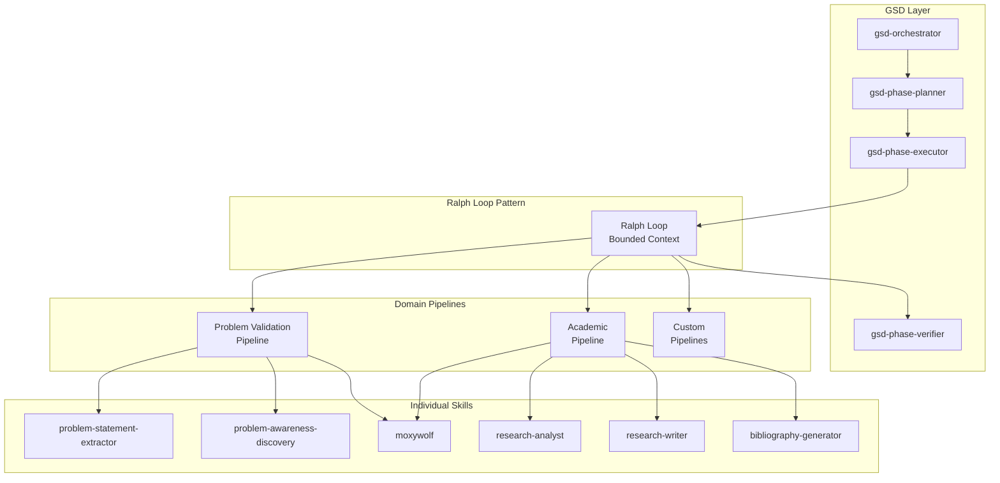
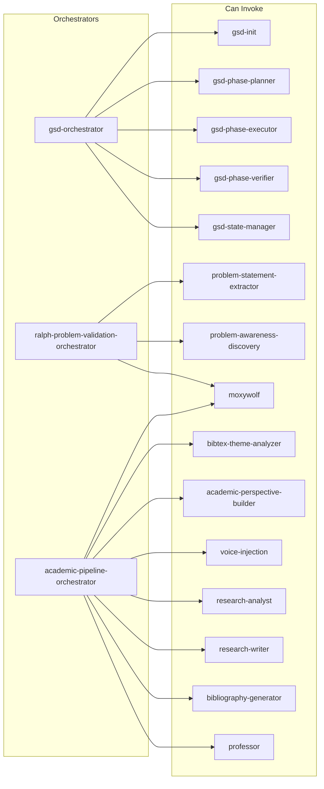

# Skill Dependencies: GSD + Ralph Loop Framework

**Project:** GSD Ralph
**Phase:** 3 - Gap Analysis & Skill Development
**Task:** 3.2 - Skill Dependencies
**Created:** 2026-01-19

---

## 1. GSD Orchestration Flow

How GSD skills invoke and depend on each other:

---

## 2. GSD Lifecycle Sequence

The complete project lifecycle:

---

## 3. Ralph Loop Execution Pattern

How gsd-phase-executor implements bounded context iterations:

---

## 4. Ralph Loop Pipeline (Problem Validation)

The 4-phase problem validation pipeline:

```mermaid
flowchart LR
    subgraph "Phase 1"
        P1[Orchestrator<br/>Assessment]
        H1[phase1-to-phase2.json]
    end

    subgraph "Phase 2"
        P2[problem-statement-<br/>extractor]
        H2[phase2-to-phase3.json]
    end

    subgraph "Phase 3"
        P3[problem-awareness-<br/>discovery]
        H3[phase3-to-phase4.json]
    end

    subgraph "Phase 4"
        P4[moxywolf<br/>+ docx]
        OUT[validation_report.docx]
    end

    INPUT[User Problem<br/>Description] --> P1
    P1 -->|ASSESSMENT_COMPLETE| H1
    H1 --> P2
    P2 -->|EXTRACTION_COMPLETE| H2
    H2 --> P3
    P3 -->|RESEARCH_COMPLETE| H3
    H3 --> P4
    P4 -->|REPORT_COMPLETE| OUT
```

**Handoff Token Flow:**

---

## 5. Academic Pipeline (8 Stages)

Complete academic content generation workflow:

**Key Innovation Highlighted:**

---

## 6. Cross-Framework Integration

How GSD orchestrates domain skills:

---

## 7. Skill Invocation Matrix

Which skills can invoke which other skills:

---

## 8. Dependency Summary Table

| Skill | Depends On | Depended By |
|-------|------------|-------------|
| gsd-init | - | All GSD skills |
| gsd-orchestrator | gsd-init | - |
| gsd-phase-planner | gsd-init | gsd-phase-executor |
| gsd-phase-executor | gsd-phase-planner | gsd-phase-verifier |
| gsd-phase-verifier | gsd-phase-executor | - |
| gsd-state-manager | gsd-init | gsd-phase-planner |
| problem-statement-extractor | - | problem-awareness-discovery |
| problem-awareness-discovery | problem-statement-extractor | moxywolf (in pipeline) |
| moxywolf | - | Multiple (terminal skill) |
| research-analyst | perspective-builder, voice-injection | research-writer |
| research-writer | research-analyst | bibliography-generator |
| bibliography-generator | research-writer | professor |
| professor | bibliography-generator | - |

---

## Completion Status

**Task 3.2:** Skill Dependencies - `DEPENDENCY_GRAPH_COMPLETE`

**Diagrams Created:** 8
**Formats:** Mermaid flowcharts and sequence diagrams
**Coverage:** GSD lifecycle, Ralph Loop, Academic Pipeline, Cross-framework

